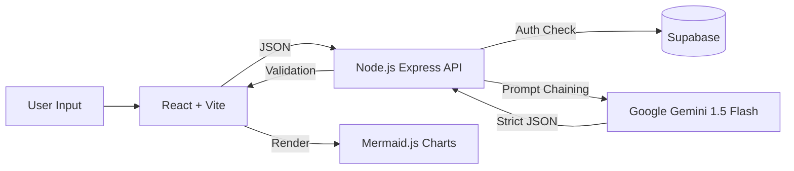

# 🧠 AI Project Analyzer & Architecture Generator


> **A decision-support system that converts raw project ideas into structured, engineering-grade blueprints.**

🔗 **Live Demo:** https://YOUR_VERCEL_URL.vercel.app
*(Note: Initial analysis may take ~30s due to Render Free Tier cold start)*

---

## 🧩 The Problem

Most early-stage developers and hackathon teams fail not because of a lack of coding skills, but because of **poor planning**.

* **Scope Creep:** Trying to build "Uber" in a weekend.
* **Tech Stack Mismatch:** Using Kubernetes for a simple To-Do list.
* **Hidden Risks:** Ignoring data privacy, API costs, or architectural bottlenecks.

## 💡 The Solution

This is **not a wrapper** around ChatGPT. It is a deterministic engineering tool that uses AI to enforce **constraint-based reasoning**.

Instead of a chat interface, it uses a multi-step pipeline to:

1. **Brutalize Scope:** Aggressively cuts features based on team size & timeline.
2. **Visual Architecture:** Generates real-time **Mermaid.js** system diagrams.
3. **Feasibility Engine:** Calculates a 0-100 "Survival Score" based on constraints.
4. **Monetization Simulation:** Implements a credit-based SaaS model (Freemium → Pro).

---

## 📸 Screenshots

*(Add a screenshot of your dashboard here for maximum impact)*


---

## 🏗️ Architecture & Tech Stack

The system follows a **decoupled Client-Server-Intelligence** architecture:



### 🔹 Frontend (The Body)

* Framework: React + Vite (TypeScript)
* Styling: Tailwind CSS + Framer Motion
* Auth: Clerk (JWT-based Authentication)
* Visualization: Mermaid.js (Architecture Diagrams)

### 🔹 Backend (The Brain)

* Runtime: Node.js (Express)
* AI Engine: Google Gemini 1.5 Flash (via structured prompting)
* Database: Supabase (PostgreSQL) for user credits & shared projects
* Security: Row Level Security (RLS) & Server-side Validation

---

## 🚀 Key Features

### 🥇 Feasibility "Reality Check"

The system audits your idea against your constraints. If you say "I want to build a Social Network in 2 days," the AI will flag it as **High Risk** and suggest a pivot (e.g., "Build a newsletter instead").

### 🥈 Dynamic Architecture Diagrams

Unlike text-only tools, this generates a visual flowchart of your system (Frontend → Backend → Database → 3rd Party APIs) using dynamic Mermaid.js rendering.

### 🥉 SaaS Credit System

A fully functional credit-based economy:

* Guests: 3 Local Credits (LocalStorage)
* Users: 10 Monthly Credits (Synced to Supabase)
* Payments: Simulated Stripe flow to "Buy" more credits

### 🔗 Deep Linking & Sharing

State is persisted via Database Storage. Users can generate a unique short URL (e.g., `/dashboard?id=xyz`) to share their full engineering blueprint with co-founders.

---

## 🛠️ Getting Started (Local Dev)

### Prerequisites

* Node.js v18+
* Google Gemini API Key
* Supabase Account
* Clerk Account

### 1. Clone & Install

```bash
git clone https://github.com/YOUR_USERNAME/project-plan-assistant.git
cd project-plan-assistant

# Install Frontend
npm install

# Install Backend
cd server
npm install
```

### 2. Configure Environment

**Frontend (.env):**

```env
VITE_API_URL=http://localhost:5000
VITE_CLERK_PUBLISHABLE_KEY=pk_test_...
VITE_CLERK_SIGN_IN_FORCE_REDIRECT_URL=/dashboard
VITE_CLERK_SIGN_UP_FORCE_REDIRECT_URL=/dashboard
```

**Backend (server/.env):**

```env
PORT=5000
GEMINI_API_KEY=AIzaSy...
SUPABASE_URL=https://xyz.supabase.co
SUPABASE_SERVICE_KEY=eyJ...
```

### 3. Run Locally

You need two terminal windows:

**Terminal 1 (Backend):**

```bash
cd server
npm run dev
# Output: 🚀 AI Brain online at http://localhost:5000
```

**Terminal 2 (Frontend):**

```bash
npm run dev
# Output: VITE ready in ~500 ms
```

---

## 🔮 Future Roadmap

* Jira Integration: One-click export of features to Jira tickets
* GitHub Scaffold: Auto-generate package.json and folder structure based on the plan
* Cost Estimator: Real-time cloud cost calculation based on selected tech stack

---

## 🤝 Contributing

Contributions are welcome! Please open an issue or submit a pull request.

---

